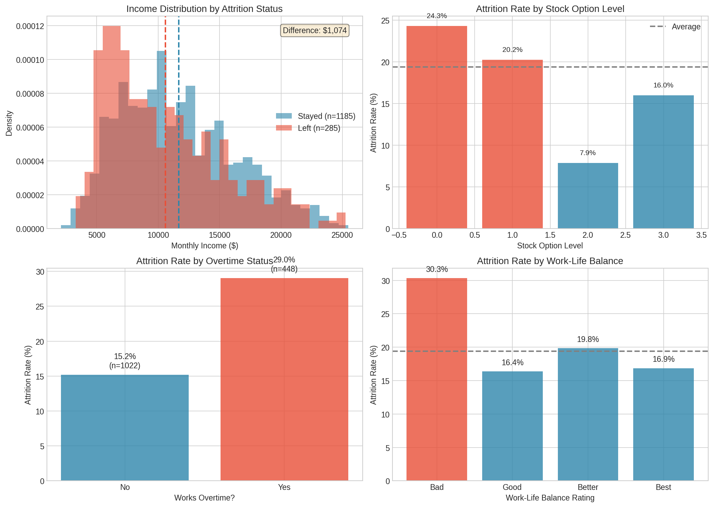

# The Talent Retention Puzzle (EDA + Hypothesis Testing)

An exploratory data analysis project that investigates *why* attrition spiked in **Engineering** and **Sales** over the last 12 months, using hypothesis testing via visualization and feature-interaction analysis.

## Business question
> Is turnover primarily a **compensation** issue, or are **burnout / environment** factors driving resignations?

## Dataset
IBM HR Analytics Employee Attrition & Performance (commonly hosted on Kaggle).

- Place the CSV here: `data/raw/hr_employee_attrition.csv`
- The repo is configured to **ignore raw data** by default (see `.gitignore`).

## Project structure
```
.
├── notebooks/                       # analysis notebook(s)
├── src/                             # helper code (optional)
├── data/
│   ├── raw/                         # raw dataset (ignored by git)
│   └── processed/                   # processed data (ignored by git)
├── outputs/                         # generated artifacts (ignored by git)
├── reports/
│   ├── Retention_Strategy_Memo.docx # stakeholder memo
│   └── figures/                     # figures used in README
├── requirements.txt
└── README.md
```

## Key deliverables
- **Notebook:** `notebooks/Talent_Retention_Puzzle_Analysis.ipynb`
- **Retention Strategy Memo:** `reports/Retention_Strategy_Memo.docx`
- **Outputs (example):** `outputs/high_risk_employees.csv`

## How to run

### Option A — VS Code (recommended)
1. Create + activate a virtual environment:
   ```bash
   python3 -m venv .venv
   source .venv/bin/activate
   ```
2. Install dependencies:
   ```bash
   pip install -r requirements.txt
   ```
3. Register the kernel (optional but recommended):
   ```bash
   python -m ipykernel install --user --name talent-retention --display-name "Python (talent-retention)"
   ```
4. Open the notebook in VS Code and select the kernel.

### Option B — Terminal + browser
```bash
python3 -m venv .venv
source .venv/bin/activate
pip install -r requirements.txt
jupyter notebook
```

## Results preview




## Notes
- The notebook creates `outputs/` automatically (for saved charts and CSV exports).
- If you want to version outputs/figures, adjust `.gitignore` accordingly.
